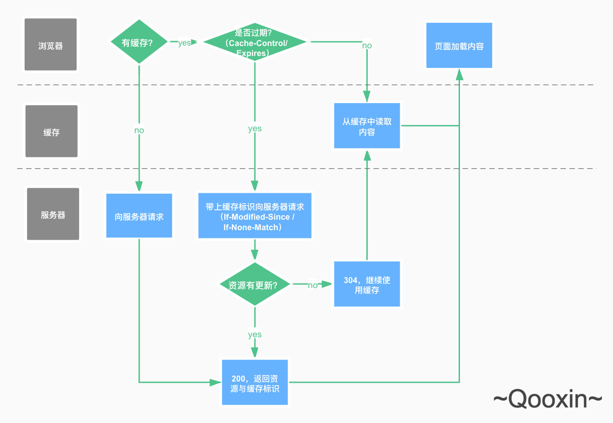
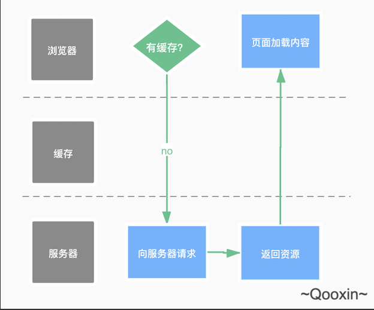

#浏览器缓存

###概述
>浏览器缓存：也是我们说的HTTP缓存机制。

在浏览器首次向服务器获取资源后，浏览器会根据回包HTTP头中的缓存标识决定是否缓存结果。当浏览器再次对相同的资源发起请求后，命中缓存的资源便能快速地在缓存中获取，从而极大地缩短了请求的耗时。另一方面，在请求量极大的情况下，浏览器的缓存也能在一定程度上降低对服务器的压力。

浏览器对某一资源的请求流程大致如下图：

###强制缓存

强制缓存是指根据缓存规则向浏览器缓存查找资源，并决定是否使用缓存资源的过程。这个过程由HTTP响应报头中的`Expires`和`Cache-Control`字段控制。

####Expires
`Expires`是HTTP/1.0实现浏览器缓存的字段，服务器在返回请求时将资源的过期时间写到回包的报头中。当浏览器再次对相同的资源发起请求，浏览器首先会检查当前时间是否小于Expires字段声明的过期时间。满足条件则直接使用缓存中的结果。

> expires: Tue, 25 May 2021 13:29:13 GMT

不难发现，上述说明浏览器用客户端的时间与服务器返回的时间做对比得出资源是否过期的结论是不可靠的。这种比较方法依赖于客户端的时间设置是否与服务器相同，比如在时区设置差异的情况下，这种比较方法就会产生误差，令缓存是否生效的判定无法达到预期。

####Cache-Control
考虑到`Expires`的局限性，HTTP/1.1新增了`Cache-Control`字段来实现浏览器缓存。在两者同时出现的情况下，`Cache-Control`会有更高的优先级。

Cache-Control的主要取值有：
- `public`： 所有内容都将被缓存。
- `private`: 所有内容只在客户端缓存，是`Cache-Control`的默认取值。
- `no-cache`: 客户端缓存内容，是否使用缓存资源需要经过协商缓存确认。
- `no-store`: 所有内容都不会被缓存。
- `max-age=xxx`: xxx是一个时间长度，表示资源将在xxx秒后失效。

> 那么你知道max-age=0代表什么意思吗？

####强制缓存相关的情况

**强制缓存生效：** 浏览器缓存中命中，缓存资源未过期，直接使用缓存资源。

**强制缓存失效：** 浏览器缓存无命中，向服器发起HTTP请求获取资源。

**强制缓存失效，进行后续协商缓存：** 浏览器缓存中命中，缓存资源已过期，进行协商缓存（携带缓存标识向服务器请求资源）。

从上面三张图可以看到，强制缓存失效的情况下，请求行为区分于是否命中缓存。在命中缓存并且资源过期的情况下，浏览器就开始了协商缓存的过程。

### 协商缓存

协商缓存是在强制缓存失效后，浏览器携带资源的缓存标识向服务器请求的过程。控制协商缓存的字段是 `Last-Modified/If-Modified-Since`和`Etag/If-None-Matched`。其中后者的优先级比前者高。

#### Last-Modified / If-Modified-Since

`Last-Modified`是服务器在请求回包头部中携带的字段，标识服务器以请求的时刻为基准最近一次修改资源的时间。

> 回包报头
Last-Modified: Tue, 2 May 2021 13:29:13 GMT

> 请求报头
If-Modified-Since: Tue, 2 May 2021 13:29:13 GMT

协商缓存中携带缓存标识就是将上次请求返回的`Last-Modified`放到请求资源的请求头`If-Modified-Since`中。服务器收到请求后，会将从`If-Modified-Since`取出的时间与服务器当前该请求资源的最近一次修改时间作对比，若服务器上的资源修改时间大于`If-Modified-Since`的值，则代表客户端缓存的资源不是最新资源，服务器将重新返回最新资源，对应的状态码为200。否则代表客户端缓存的资源仍然有效，对应的返回码为304。

> 304-Not-Modified, 提示客户端缓存资源未改动，资源会被重定向到浏览器缓存。

基于文件修改时间来判断资源在客户端是否有效主要存在两个问题：
1. 当编辑文件后，文件内容没有发生变化，服务器却基于最新编辑时间更新了文件修改时间。这将使得浏览器缓存的资源在仍然是最新内容的情况下被判定失效。
2. `Last-Modified/If-Modified-Since` 对比时间的精度在秒级别。当我们在毫秒级别内完成了对文件的修改，便可能存在文件内容已更新，但服务器维持的最近一次更新时间与上一次更新时间相同，导致协商缓存的资源是否有效判定出错。

在上述问题的背景下，`Etag/If-None-Matched`被引入。

#### Etag / If-None-Matched

`Etag`是服务器为每一资源生成的唯一标识符。由于Etag是基于文件内容编码后生成的，它能感知资源内容的变化。当服务器响应请求时，会将请求资源对应的标识符放入回包报头的`Etag`字段中。

`If-None-Matched`
客户端再次请求同一资源时，会将上次请求返回的`Etag`放到请求资源的请求头`If-None-Matched`中。服务器收到请求后会比对接收到的Etag与服务器上该资源当前的Etag是否一致。如果不一致，服务器将重新返回最新资源，对应的状态码为200。否则代表客户端缓存的资源仍然有效，对应的返回码为304。

> Etag的生成是需要耗费服务器资源的，所以它往往是作为`Last-Modified/If-Modified-Since`的补充出现。当他们一起出现的时候`Etag/If-None-Matched`优先级更高。

### 总结
浏览器发送请求首先进行强制缓存的流程。强制缓存（`Expires`和`Cache-Control`）生效直接使用缓存，否则进行协商缓存。协商缓存是浏览器携带缓存标识（`Last-Modified/If-Modified-Since`和`Etag/If-None-Matched`）向服务器发起请求，由服务器判定缓存是否有效。协商缓存生效时，服务器判定缓存资源有效，返回304。协商缓存失效时，返回200与请求的资源。

现在，回头再看这张图是不是更清晰了呢

### 最后的问题

上面提到：
> 那么你知道max-age=0代表什么意思吗？

这个问题的解答，在了解完协商缓存之后可能会更容易理解一些。

`max-age=0`代表资源不会有强制缓存生效的情况，客户端再次请求同一资源时总是需要携带缓存标识去服务器判定当前缓存是否可以继续使用。这适合对一致性有很高要求的资源，在资源没更新的情况下，服务器仅返回304指示客户端使用缓存，不仅节省了需要回复完整资源的带宽，也提高了客户端的响应速度。在资源更新的情况下，客户端能保证拿到最新的资源。

